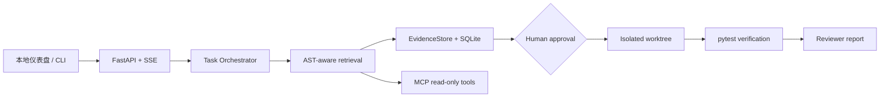

# RepoPilot

面向 Python 仓库的证据驱动、安全代码维护 Agent。它将 Issue、报错或小范围修复需求转化为可追溯任务：检索代码与测试、记录证据、提出最小补丁、等待人工批准、在隔离工作区执行、验证测试并生成审查结论。

> RepoPilot 是受控的本地代码维护 Agent，不是无人值守的通用代码生成器。它绝不会直接改动目标仓库。



## 亮点

- AST 函数、类、模块切分，以及关键词和符号加权代码检索。
- 明确的任务状态机：计划、检索、执行、待审批、隔离应用、验证、审查、完成/取消。
- SQLite 检查点：任务、证据、补丁建议和事件轨迹都可恢复。
- 人工审批门：补丁只会在 Git worktree 或隔离副本中应用。
- 本地仪表盘：可查看计划、代码证据、Diff、测试输出与审查结论。
- 真实 MCP Server：向外部 Agent 暴露受限的代码搜索、文件读取和 pytest 工具。
- 可复现分页 off-by-one 演示；不依赖 API Key 或大模型。

## 快速开始

要求 Python 3.10+。

```powershell
python -m pip install -e '.[api,mcp,dev]'
$env:REPOPILOT_REPO_PATH = "$PWD"
python -m uvicorn repopilot.app:app --app-dir src --host 127.0.0.1 --port 8000
```

打开 `http://127.0.0.1:8000`，输入一个 Issue。界面会先展示计划和证据；只有点击“批准并生成隔离 Diff”后，才会在隔离目录中生成补丁。再点击“运行验证与审查”完成闭环。

若要体验控制好的演示案例，可把目标仓库设置为：

```powershell
$env:REPOPILOT_REPO_PATH = "$PWD/demo/cases/pagination_off_by_one"
python -m uvicorn repopilot.app:app --app-dir src --host 127.0.0.1 --port 8000
```

## CLI

```powershell
$env:PYTHONPATH = "$PWD/src"
python -m repopilot.cli ./demo/cases/pagination_off_by_one "第一页漏掉第一条订单，list_orders 的 offset 错误" --propose
```

添加 `--approve` 会在隔离工作区应用建议并运行测试，原演示目录保持不变。

## HTTP API

| 方法 | 路径 | 作用 |
| --- | --- | --- |
| `POST` | `/api/tasks` | 创建分析任务并生成安全补丁建议 |
| `GET` | `/api/tasks/{task_id}` | 查询或恢复任务 |
| `GET` | `/api/tasks/{task_id}/events` | 获取 SSE 事件轨迹 |
| `POST` | `/api/tasks/{task_id}/approve` | 人工批准，在隔离工作区生成补丁和 Diff |
| `POST` | `/api/tasks/{task_id}/reject` | 拒绝建议，不修改任何代码 |
| `POST` | `/api/tasks/{task_id}/verify` | 在隔离工作区运行受限 pytest 并审查 |
| `GET` | `/api/tasks/{task_id}/report` | 获取 Markdown 报告 |

## MCP Server

```powershell
$env:REPOPILOT_REPO_PATH = "C:/path/to/python-repo"
python -m repopilot.mcp_server.server
```

它使用 stdio，提供 `search_code`、`read_file`、`run_tests` 三个受限工具。补丁写入能力不会通过 MCP 暴露，必须经由人工审批 API。

## 演示与边界

| 场景 | 支持程度 |
| --- | --- |
| 分页 off-by-one | 完整 Issue → 建议 → 审批 → 隔离修复 → pytest → 审查 |
| 可选字段异常 | Issue 与代码检索演示 |
| 路径穿越 | Issue 与风险定位演示 |

当前版本仅分析 Python，并且只对受控分页模式给出确定性补丁；其他问题只生成证据，不会臆造修改。模型、向量检索和 GitHub 自动提交尚未接入。详见 [架构说明](docs/ARCHITECTURE.md)、[MCP 使用说明](docs/MCP.md) 和 [限制说明](docs/LIMITATIONS.md)。
