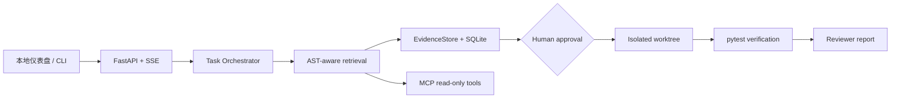

# RepoPilot

[](https://github.com/zmh2245749337/repopilot-agent/actions/workflows/ci.yml)

面向 Python 仓库的证据驱动、安全代码维护 Agent。它将 Issue、报错或小范围修复需求转化为可追溯任务：检索代码与测试、记录证据、提出最小补丁、等待人工批准、在隔离工作区执行、验证测试并生成审查结论。

> RepoPilot 是受控的本地代码维护 Agent，不是无人值守的通用代码生成器。它绝不会直接改动目标仓库。



## 亮点

- AST 函数、类、模块切分，BM25 词法检索与可选 OpenAI-compatible Embedding 的 RRF 融合检索。
- 明确的任务状态机：计划、检索、执行、待审批、隔离应用、验证、审查、完成/取消。
- SQLite 检查点：任务、证据、补丁建议和事件轨迹都可恢复。
- 人工审批门：补丁只会在 Git worktree 或隔离副本中应用。
- 本地仪表盘：可查看计划、代码证据、Diff、测试输出与审查结论。
- 真实 MCP Server：向外部 Agent 暴露受限的代码搜索、文件读取和 pytest 工具。
- 三个可复现的受控 Bug 演示；默认不依赖 API Key 或大模型。

## 快速开始

要求 Python 3.10+。

```powershell
python -m pip install -e '.[api,mcp,dev]'
$env:REPOPILOT_REPO_PATH = "$PWD"
python -m uvicorn repopilot.app:app --app-dir src --host 127.0.0.1 --port 8000
```

打开 `http://127.0.0.1:8000`，输入一个 Issue 与复现测试目标。界面会先展示计划和证据；接着点击“运行基线复现”，只有当原仓库中的目标测试确实失败，才会生成待审批建议。批准后才会在隔离目录中生成补丁，并在**同一测试目标**上运行回归验证与审查。

若要体验控制好的演示案例，可把目标仓库设置为：

```powershell
$env:REPOPILOT_REPO_PATH = "$PWD/demo/cases/pagination_off_by_one"
python -m uvicorn repopilot.app:app --app-dir src --host 127.0.0.1 --port 8000
```

## CLI

```powershell
$env:PYTHONPATH = "$PWD/src"
python -m repopilot.cli ./demo/cases/pagination_off_by_one "第一页漏掉第一条订单，list_orders 的 offset 错误" --propose
```

添加 `--approve` 会在隔离工作区应用建议并运行测试，原演示目录保持不变。

## Code RAG Copilot

仪表盘顶部提供只读的 Code RAG Copilot：它会识别代码问答、函数摘要、依赖定位、测试建议和安全扫描等意图，自动路由到对应只读工具；再通过 AST/BM25 与可选 Embedding 的混合检索定位代码，并把文件、行号和检索通道显示为引用。它支持追问改写、多轮上下文和流式回答。配置已有的 `REPOPILOT_MODEL_*` 环境变量后，会调用 OpenAI-compatible `/chat/completions` 生成严格基于检索证据的回答；未配置或模型异常时自动回退到离线证据回答。

聊天接口为 `POST /api/chat`，流式接口为 `POST /api/chat/stream`；传入 `message`、可选 `conversation_id` 和 `top_k`。响应包含回答、引用、模型提供方、回退标记、意图、工具路由和 Agent 轨迹。该接口始终只读，不能创建、批准或应用补丁。

仪表盘还支持隔离导入公开 GitHub 仓库或 ZIP：GitHub 仅接受 `https://github.com/owner/repo`，ZIP 会限制大小、文件数、解压大小，并拦截路径穿越。导入后可浏览文件树，点击聊天引用预览源代码；导入副本不会覆盖本地仓库。

详细设计与配置见 [Code RAG 说明](docs/CODE_RAG.md)。

## HTTP API

| 方法 | 路径 | 作用 |
| --- | --- | --- |
| `POST` | `/api/tasks` | 创建分析任务、计划和证据 |
| `GET` | `/api/tasks/{task_id}` | 查询或恢复任务 |
| `GET` | `/api/tasks/{task_id}/events` | 获取 SSE 事件轨迹 |
| `POST` | `/api/tasks/{task_id}/reproduce` | 在原仓库运行基线复现；失败后才生成待审批建议 |
| `POST` | `/api/tasks/{task_id}/approve` | 人工批准，在隔离工作区生成补丁和 Diff |
| `POST` | `/api/tasks/{task_id}/reject` | 拒绝建议，不修改任何代码 |
| `POST` | `/api/tasks/{task_id}/verify` | 在隔离工作区对同一目标运行 pytest 并审查前后证据 |
| `GET` | `/api/tasks/{task_id}/report` | 获取 Markdown 报告 |

## MCP Server

```powershell
$env:REPOPILOT_REPO_PATH = "C:/path/to/python-repo"
python -m repopilot.mcp_server.server
```

它使用 stdio，提供 `search_code`、`read_file`、`run_tests` 三个受限工具。补丁写入能力不会通过 MCP 暴露，必须经由人工审批 API。

## 演示与边界

| 场景 | 支持程度 |
| --- | --- |
| 分页 off-by-one | 完整 Issue → 建议 → 审批 → 隔离修复 → pytest → 审查 |
| 可选字段异常 | Issue 与代码检索演示 |
| 路径穿越 | Issue 与风险定位演示 |

当前版本仅分析 Python，并且只对三个受控案例给出确定性补丁；其他问题只生成证据，不会臆造修改。配置 `REPOPILOT_MODEL_*` 后，Planner 会使用 OpenAI-compatible `/chat/completions` 输出结构化计划；配置 `REPOPILOT_EMBEDDING_*` 后，检索会融合 `/embeddings` 语义排序。网络或模型异常时会自动回退到离线计划和词法检索。运行 `python scripts/run_controlled_eval.py` 可生成三案例评估结果。详见 [架构说明](docs/ARCHITECTURE.md)、[MCP 使用说明](docs/MCP.md) 和 [限制说明](docs/LIMITATIONS.md)。

每次推送与面向 `main` 的 Pull Request 都会自动执行单元/API 测试和三案例的受控评估；评估报告必须可重复生成且没有差异。

## 作品集材料

- [项目作品集说明](docs/PORTFOLIO.md)：适合 GitHub 主页、作品集页面或面试前发送。
- [3 分钟演示脚本](docs/DEMO_SCRIPT.md)：从启动到展示安全闭环的逐步讲解。
- [简历与面试表述](docs/RESUME.md)：中英文简历要点、STAR 面试故事和追问提示。
