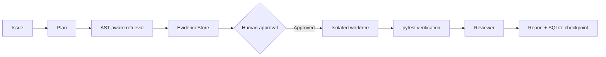

# RepoPilot

面向 Python 仓库的、带证据与人工审批门的 Issue-to-Patch Agent。它将 Issue 转换为可追溯任务：检索 AST 代码块、收集测试证据、提出最小补丁、等待审批、在隔离工作区执行、重新验证并输出审查报告。

> 这是一个受控的小范围代码维护 Agent，不是通用 IDE 或无人值守的自动改码工具。



## 已实现能力

- Python AST 函数、类和模块级代码切分，结合关键词与符号加权检索。
- 显式任务状态机与事件轨迹：计划、检索、执行、审批、应用、验证、审查、完成。
- `EvidenceStore` 保存代码定位、测试输出与补丁引用；SQLite 保存可查询检查点。
- 高风险补丁必须经过显式审批；补丁会进入 Git worktree（非 Git 演示目录则使用完整副本），不会直接修改目标仓库。
- 受限 pytest 调用：禁止绝对路径及越界路径。
- 确定性分页修复规则和可复现演示，不需要模型或 API Key。
- 可选 FastAPI + SSE 接口，用于展示任务、审批与事件流。

## 快速开始

核心演示只依赖 Python 3.10+ 和 pytest：

```bash
python -m pytest -q
$env:PYTHONPATH = "$PWD/src"  # PowerShell
python -m repopilot.cli ./demo/cases/pagination_off_by_one "第一页漏掉第一条订单，list_orders 的 offset 错误" --propose
```

上面命令只生成建议，状态会停在 `waiting_approval`。确认要运行完整流程时：

```bash
python -m repopilot.cli ./demo/cases/pagination_off_by_one "第一页漏掉第一条订单，list_orders 的 offset 错误" --propose --approve
```

`--approve` 是人工审批的命令行表达；修复只写入隔离目录，原演示仓库仍保留缺陷以便重复演示。

## 可选 Web API

安装 API 额外依赖后：

```bash
pip install -e '.[api]'
uvicorn repopilot.api:create_app --factory --reload --port 8000
```

`create_app()` 需要传入目标仓库路径，因此生产启动建议采用一个很薄的项目启动文件，例如 `create_app("/path/to/repo")`。接口包括：创建任务、读取检查点、审批、验证审查和 SSE 事件流。

## 演示场景与边界

| 场景 | 当前支持 |
| --- | --- |
| 分页 off-by-one | 完整 Issue → 建议 → 审批 → 隔离修复 → pytest → 审查 |
| 可选字段异常 | Issue 与代码检索演示 |
| 路径穿越 | Issue 与风险定位演示 |

当前版本只支持 Python、小范围文本补丁与允许的 pytest 命令；没有接入大模型、向量数据库、MCP 服务或自动推送 GitHub。模型接入应替换 Planner 层，且仍必须保留证据、审批与隔离执行边界。

详见 [架构说明](docs/ARCHITECTURE.md) 和 [限制说明](docs/LIMITATIONS.md)。
