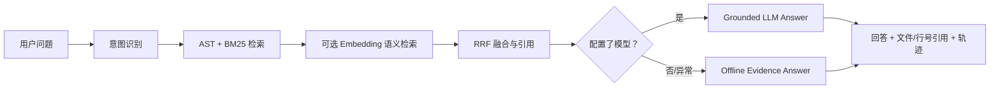

# Code RAG Copilot

Code RAG Copilot 是 RepoPilot 的只读对话层。它用于解释仓库代码、定位符号、辅助理解测试和初步识别安全风险；它不能修改文件，也不能调用批准、补丁或隔离工作区能力。

## Agent 路径



## 支持的对话能力

- **代码问答 / 定位**：例如“`list_orders` 的分页逻辑在哪里？”
- **函数摘要**：例如“解释 `resolve_download_path` 函数。”
- **依赖定位**：例如“这个函数依赖哪些导入？”
- **仓库概览**：例如“总结订单模块的实现。”
- **测试引导**：例如“应该运行哪个 pytest 目标？”
- **安全扫描**：例如“这里有什么路径穿越风险？”；只读规则初筛，仍需人工审查数据流。
- **追问改写与多轮上下文**：遇到“它 / 这个函数 / it”等指代词时，附加上一轮问题作为检索上下文；每一轮仍重新检索当前仓库。
- **流式回答**：`/api/chat/stream` 通过 SSE 依次返回意图、查询改写、工具选择、检索元数据和回答增量。模型流中断时会重置半段回答，再显示离线证据回退，避免混合结果。

## 证据与模型边界

每次响应包含：

- `citations`：相对文件路径、符号、开始/结束行、检索通道和代码摘录。
- `trace`：意图识别、检索完成和回答生成三个 Agent 事件。
- `intent` 与 `tool`：当前路由到的只读代码工具，例如 `search_code`、`summarize_function`、`locate_dependencies`、`suggest_tests`、`scan_safety`。
- `provider`：`offline-evidence` 或 `openai-compatible:<model>`。
- `fallback`：模型调用失败时为 `true`，此时答案由离线证据模板生成。

即使配置了模型，系统提示也会约束模型：只能根据传入的仓库证据回答，必须引用文件行号，不得声称修改文件、运行命令或批准补丁。

## 模型配置

Code RAG Copilot 与 Planner 共用以下 OpenAI-compatible 配置：

```powershell
$env:REPOPILOT_MODEL_BASE_URL = "https://your-compatible-endpoint/v1"
$env:REPOPILOT_MODEL_NAME = "your-model"
$env:REPOPILOT_API_KEY = "your-api-key"
```

可选的语义检索配置：

```powershell
$env:REPOPILOT_EMBEDDING_BASE_URL = "https://your-compatible-endpoint/v1"
$env:REPOPILOT_EMBEDDING_MODEL = "your-embedding-model"
$env:REPOPILOT_EMBEDDING_API_KEY = "your-api-key"
```

不要把真实 Key 写入仓库或 `config.py`；请使用环境变量或本地未提交的 `.env` 文件。

## API 示例

```powershell
Invoke-RestMethod -Method Post -Uri http://127.0.0.1:8000/api/chat `
  -ContentType 'application/json' `
  -Body '{"message":"list_orders 的分页逻辑在哪里？","top_k":4}'
```

将上一轮响应的 `conversation_id` 原样传给下一轮请求，即可保留对话上下文。

## 仓库导入与代码预览

仪表盘支持两种隔离导入方式：

- 公开 GitHub URL：仅接受形如 `https://github.com/owner/repository` 的 HTTPS 地址，并以 shallow clone 导入到专用目录。
- ZIP 上传：上限 25 MB、最多 2,000 个文件、解压后最多 100 MB；拒绝绝对路径、`..` 路径穿越及隐藏的依赖/虚拟环境目录。

导入后，文件树与 `/api/repository/file?path=...` 只允许读取当前已注册的仓库根目录。代码引用可点击打开对应文件预览。它们不会把导入内容写回原仓库。

## RAG Eval

`python scripts/run_rag_eval.py` 会评估受控场景中的来源命中、符号命中、意图路由和工具选择。任何一项失败都会返回非零退出码；GitHub Actions 也会运行此检查并校验 [报告](../reports/rag_eval.json) 可重复生成。

## 安全边界

Code RAG 只读层与修复工作流故意分离。任何写入都仍需走：原仓库失败基线 → 补丁建议 → 人工批准 → 隔离工作区 → 同一目标回归 → Reviewer。这一点不会因为模型已经回答了问题而改变。
