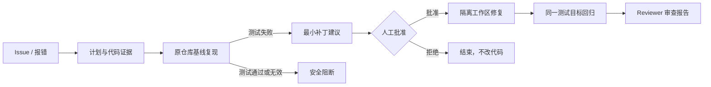

# RepoPilot 项目作品集说明

## 一句话介绍

RepoPilot 是一个面向 Python 仓库的证据驱动代码 Agent：一条路径提供带工具路由、来源引用和执行轨迹的 Code RAG Copilot；另一条路径先复现问题、定位证据，再经人工批准于隔离工作区生成和验证最小补丁。

## 要解决的问题

通用代码 Agent 容易出现三类风险：没有先确认 Bug 是否存在、修改直接落到原仓库、只看“修复后通过”而不证明修复前确实失败。RepoPilot 将这三点变成不可绕过的任务门槛。

| 风险 | RepoPilot 的处理方式 |
| --- | --- |
| Issue 描述不准确 | 先在原仓库运行指定 pytest 目标；测试未失败则不生成补丁。 |
| Agent 直接写坏代码 | 需要人工批准，且只允许写入 `git worktree` 或隔离副本。 |
| 回归验证不可信 | 固定使用同一测试目标，Reviewer 同时检查失败基线、通过结果和补丁路径。 |
| Agent 行为不可解释 | SQLite 保存任务、证据、Diff、测试输出和事件轨迹。 |

## 核心流程

## 已实现能力

- Python AST 索引、BM25 词法检索，以及可选 OpenAI-compatible Embedding 的 RRF 融合检索。
- 离线确定性 Planner；也可配置 OpenAI-compatible 服务生成结构化计划，异常时自动回退。
- Code RAG Copilot：6 个具备输入 Schema 和只读风险标记的注册工具，支持追问改写、流式回答、代码问答/函数摘要/依赖定位/测试建议/安全扫描路由、混合检索、文件行号引用和逐步 Agent 轨迹；可选模型回答严格受检索证据约束。
- SQLite 对话记忆按仓库隔离，支持新建、恢复和删除会话，历史回答可恢复原始文件/行号引用。
- 隔离仓库导入与 Explorer：可导入受限的公开 GitHub URL 或安全检查后的 ZIP，在文件树中查看代码；引用可直接打开对应文件预览。
- FastAPI 本地仪表盘、CLI 和 stdio MCP Server 三种使用入口。
- 限制性 MCP 工具：暴露基础搜索/读取/pytest，以及复用同一 Tool Registry 的代码问答、摘要、依赖、测试建议和安全扫描；不暴露补丁写入。
- SQLite 检查点和事件轨迹，可恢复任务状态与证据。
- Git 仓库根目录使用 `git worktree`；嵌套目录和非 Git 演示项目使用隔离副本，避免误操作父仓库。

## 可信度证据

项目内置 3 个受控 Bug 案例：分页 off-by-one、可选字段异常和路径穿越。当前修复评估为 3/3 完成：每个案例均记录到“修复前测试失败、隔离修复后同一测试通过、Reviewer 批准”。Code RAG 评估覆盖上述场景和项目自身符号定位，共 4/4 案例同时通过来源、符号、Top‑1、意图和工具检查。详细机器可读结果见 [controlled_eval.json](../reports/controlled_eval.json) 与 [rag_eval.json](../reports/rag_eval.json)。

本地回归包含 30 个测试；GitHub Actions 会在推送和 Pull Request 时自动运行测试、受控评估及报告可重复性检查。

## 技术栈

- **后端框架：** FastAPI + Uvicorn
- **代码解析：** Python AST
- **混合检索：** BM25 + 精确符号加权 + 可选 Embedding / RRF
- **LLM：** 智谱 GLM-4.7-Flash（OpenAI-compatible）+ 离线证据回退
- **Agent 编排：** Intent Routing + Code Tool Registry + SSE 流式事件
- **数据存储：** SQLite
- **协议：** Model Context Protocol（MCP / stdio）
- **隔离执行：** Git worktree / 隔离副本 + 人工审批
- **测试评估：** pytest + RAG Eval + GitHub Actions
- **前端：** HTML + JavaScript（无框架）

## 真实边界

RepoPilot 目前只针对 Python 分析，并仅对内置的 3 个受控案例自动生成确定性补丁。未知 Issue 会停留在“检索与证据”阶段，不假装能修复一切。这是刻意的安全设计；详细限制见 [LIMITATIONS.md](LIMITATIONS.md)。

## 面试展示建议

优先演示分页案例：输入 Issue 后运行基线复现，展示测试失败；再批准隔离补丁，展示 Diff、同一测试通过和 Reviewer 的前后证据。完整台词见 [DEMO_SCRIPT.md](DEMO_SCRIPT.md)。
